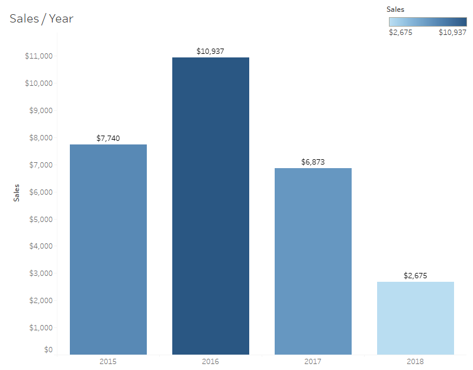
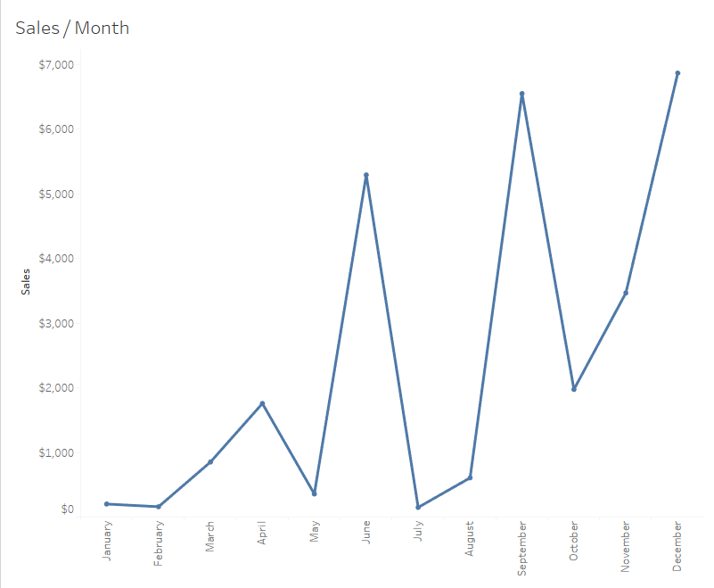
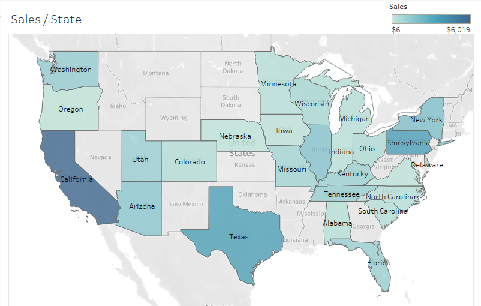
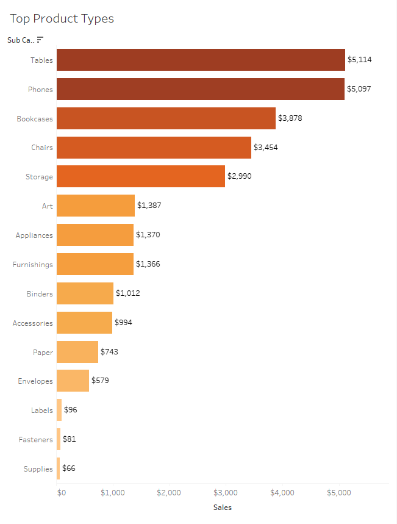

# Sales Analysis Dashboard

## Overview
This project analyzes retail sales data to uncover key insights and trends. With Tableau and Excel for visualisation and SQL for data cleansing and analysis, I created an interactive dashboard to help stakeholders track performance and make data-driven decisions.

### Objectives
- Identify high-performing regions and product categories.
- Provide a clear, visual representation of sales trends over time.

### Tools Used
- **SQL**: Data cleaning and exploratory analysis.
- **Tableau**: Dashboard creation and data visualization.
- **Excel**: Data storage, creation of helper tables, pivot tables, and dashboards with charts derived from pivot tables.

---

## Repository Structure
```
superstore-sales-dashboard/
│
├── data/
│   ├── raw_data.csv              # Original dataset
│
├── scripts/
│   ├── cleaning.sql              # SQL scripts for data cleaning
│   ├── analysis.sql              # SQL scripts for data analysis
│
├── dashboard/
│   ├── tableau_dashboard.twbx    # Packaged Tableau workbook
│   ├── excel_dashboard.xlsx      # Excel dashboard with pivot tables
│
├── README.md                     # Project documentation (this file)
└── LICENSE                       # License for the project
```

---

## Dashboard
### Tableau Public
Explore the interactive Tableau dashboard here:
[Interactive Tableau Dashboard](https://public.tableau.com/app/profile/patrick.nuevo/viz/SuperSalesDashboard_17371756988470/Dashboard1)


### Tableau Workbook
The Tableau workbook file is included in this repository:
- `dashboard/tableau_dashboard.twbx`

### Dashboard Highlights
- **Sales Trends**: Monthly sales and revenue breakdown
  
  
- **Regional Performance**: Top-performing regions visualized on a map
  
- **Product Performance**: Top-performing products
  
---

## Key SQL Queries
Here are some examples of SQL queries used in this project:

```sql
-- Checking for duplicate rows
WITH cte AS 
(
	SELECT *,
		RANK() OVER(PARTITION BY order_id, order_date, ship_date, ship_mode, 
		customer_id, customer_name, segment, country, state, postal_code, region, 
		product_id, category, sub_category, product_name, sales ORDER BY row_id) AS row_num
	FROM train
)
SELECT *
FROM cte
WHERE row_num > 1;

-- Check if the order_date follows the correct format (YYYY-MM-DD)
SELECT order_date
FROM train
WHERE order_date NOT REGEXP '^[0-9]{4}-[0-9]{2}-[0-9]{2}$';

-- Update order_date to ensure it matches the correct format (DD/MM/YYYY -> YYYY-MM-DD)
SELECT order_date, STR_TO_DATE(order_date, '%d/%m/%Y') AS formatted_date
FROM train;

UPDATE train
SET order_date = STR_TO_DATE(order_date, '%d/%m/%Y');

-- Analyze total sales per region
SELECT state, 
       ROUND(SUM(sales), 2) AS total_sales
FROM train
GROUP BY state
ORDER BY total_sales DESC;

-- Analyze sales trend over year and month
SELECT DATE_FORMAT(order_date, '%Y-%m') AS `year_month`, 
       COUNT(*) AS order_count
FROM train
GROUP BY `year_month`
ORDER BY `year_month`;
```

For the full SQL scripts, check the `scripts/` folder:
- `scripts/cleaning.sql`
- `scripts/analysis.sql`

---

## Insights
- **Top-Performing State**: The state of `California` generated the highest revenue, contributing 21.33% of total sales.
- **Most Profitable Category**: Furniture accounted for 48.93% of overall sales.
- **Top Segment by Sales**: The `Consumer` segment has the highest total sales, outperforming the `Corporate` and `Home Office` segments.

---

## Skills Demonstrated
- **Data Cleaning**: Standardized column values, removed duplicates, and handled missing data using SQL.
- **Data Analysis**: Aggregated and filtered data to uncover trends and patterns.
- **Dashboard Creation**: Designed interactive visualizations to make insights accessible to stakeholders.

---

## Steps to Reproduce
1. Clone the repository:
   ```bash
   git clone https://github.com/psnuevo/superstore-sales-dashboard.git
   ```
2. Open the `raw_data.xlsx` file to view the original dataset.
3. Run the SQL scripts in the `scripts/` folder to clean and analyze the data.
4. Open `dashboard/tableau_dashboard.twbx` in Tableau Desktop or view the interactive version on Tableau Public.

---

## Contact
For inquiries or feedback, feel free to reach out:
- **Email**: s.nuevopatrick@gmail.com
